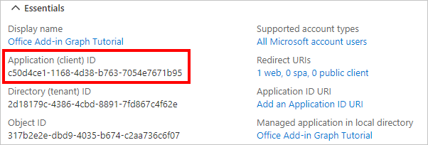

<!-- markdownlint-disable MD002 MD041 -->

この演習では、Azure Active Directory 管理センターを使用AD新しい Azure AD Web アプリケーションの登録を作成します。

1. ブラウザーを開き、[Azure Active Directory 管理センター](https://aad.portal.azure.com)へ移動します。 **個人用アカウント** (別名: Microsoft アカウント)、または **職場/学校アカウント** を使用してログインします。

1. 左側のナビゲーションで **[Azure Active Directory]** を選択し、それから **[管理]** で **[アプリの登録]** を選択します。

    

1. **[新規登録]** を選択します。 **[アプリケーションを登録]** ページで、次のように値を設定します。

    - `Office Add-in Graph Tutorial` に **[名前]** を設定します。
    - **[サポートされているアカウントの種類]** を **[任意の組織のディレクトリ内のアカウントと個人用の Microsoft アカウント]** に設定します。
    - **[リダイレクト URI]** で、最初のドロップダウン リストを `Single-page application (SPA)` に設定し、それから `https://localhost:3000/consent.html` に値を設定します。

    ![[アプリケーションを登録する] ページのスクリーンショット](images/register-an-app.png)

1. **[登録]** を選択します。 [Office **Graph** チュートリアル] ページで、アプリケーション **(クライアント) ID** の値をコピーして保存します。次の手順で必要になります。

    

1. **[管理]** で **[証明書とシークレット]** を選択します。 
            **[新しいクライアント シークレット]** ボタンを選択します。 **[説明]** に値を入力して、**[有効期限]** のオプションのいずれかを選び、**[追加]** を選択します。

1. クライアント シークレットの値をコピーしてから、このページから移動します。 次の手順で行います。

    > [!IMPORTANT]
    > このクライアント シークレットは今後表示されないため、今必ずコピーするようにしてください。

1. [管理 **] で [API のアクセス** 許可 **] を選択し**、[アクセス許可の **追加] を選択します**。

1. **[Microsoft Graph] を選択** し、[**委任されたアクセス許可] を選択します**。

1. 次のアクセス許可を選択し、[アクセス許可の追加 **] を選択します**。

    - **offline_access** - これにより、アプリは期限切れになったときにアクセス トークンを更新できます。
    - **Calendars.ReadWrite** - これにより、アプリはユーザーの予定表を読み書きできます。
    - **MailboxSettings.Read** - これにより、アプリはメールボックス設定からユーザーのタイム ゾーンを取得できます。

    

## アドインOfficeシングル サインオンを構成する

このセクションでは、アプリの登録を更新して、Office シングル サインオン [(SSO) をサポートします](https://docs.microsoft.com/office/dev/add-ins/develop/sso-in-office-add-ins)。

1. [API **の公開] を選択します**。 [この **API で定義されているスコープ** ] セクションで、[スコープの追加 **] を選択します**。 アプリケーション ID **URI** の設定を求めるメッセージが表示されたら、アプリケーション ID に置き換える値 `api://localhost:3000/YOUR_APP_ID_HERE` `YOUR_APP_ID_HERE` を設定します。 [保存 **] を選択して続行します**。

1. フィールドに次のように入力し、[範囲の追加 **] を選択します**。

    - **スコープ名:**`access_as_user`
    - **同意できるユーザー: 管理者とユーザー**
    - **管理者の同意の表示名:**`Access the app as the user`
    - **管理者の同意の説明:**`Allows Office Add-ins to call the app's web APIs as the current user.`
    - **ユーザーの同意の表示名:**`Access the app as you`
    - **ユーザーの同意の説明:**`Allows Office Add-ins to call the app's web APIs as you.`
    - **状態: 有効**

    ![[範囲の追加] フォームのスクリーンショット](images/add-scope.png)

1. [承認済み **クライアント アプリケーション] セクションで** 、[クライアント アプリケーションの **追加] を選択します**。 次の一覧からクライアント ID を入力し、[承認済みスコープ] の下のスコープを有効にして、[アプリケーションの追加]**を選択します**。 リスト内の各クライアント ID に対してこのプロセスを繰り返します。

    - `d3590ed6-52b3-4102-aeff-aad2292ab01c` (Microsoft Office)
    - `ea5a67f6-b6f3-4338-b240-c655ddc3cc8e` (Microsoft Office)
    - `57fb890c-0dab-4253-a5e0-7188c88b2bb4` (Office on the web)
    - `08e18876-6177-487e-b8b5-cf950c1e598c` (Office on the web)
